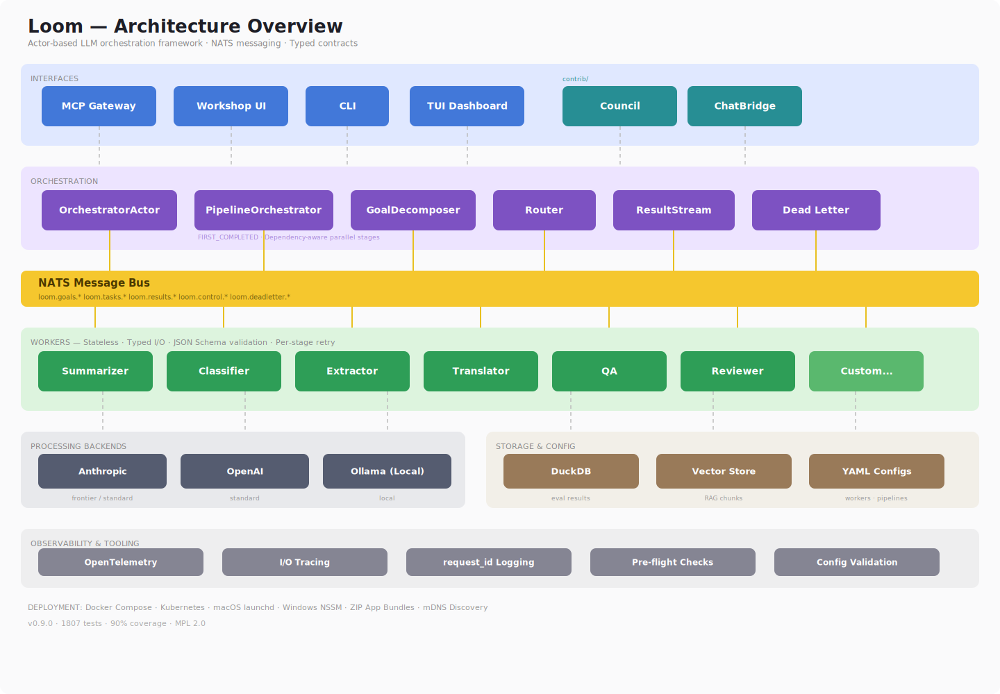

# Heddle

[](https://github.com/getheddle/heddle/actions/workflows/ci.yml)
[](https://getheddle.github.io/heddle/)
[](https://codecov.io/github/getheddle/heddle)
[](https://github.com/astral-sh/ruff)
[](LICENSE)
[](https://www.python.org/downloads/)
<!-- Keep in sync with pyproject.toml version -->
[](https://github.com/getheddle/heddle)
[]()

**Turn what you know into testable AI steps. Chain them into workflows.
Measure whether they work. Scale when ready.**



---

## Try It in 60 Seconds

```bash
pip install heddle-ai[workshop]                         # install from PyPI
heddle setup                                            # configure (auto-detects LM Studio + Ollama)
heddle workshop                                         # open web UI at localhost:8080
```

Open your browser → pick a worker (summarizer, classifier, extractor) →
paste any text → click Run. No data files needed.

**Have Telegram exports?** Install with `pip install heddle-ai[rag]` instead,
then run `heddle rag ingest`, `heddle rag search`, and `heddle rag serve` for
full social media stream analysis.

Or from source:

```bash
git clone https://github.com/getheddle/heddle.git && cd heddle
uv sync --extra workshop
uv run heddle setup
```

No servers to run. No configuration files to write. The setup wizard handles everything.

---

## What Heddle Does

Most AI tools give you one big prompt and one model. That works until it
doesn't — the prompt gets unwieldy, you can't test parts independently,
and asking the same model to review its own work doesn't catch real
problems.

Heddle splits AI work into focused **steps**. Each step has a clear job, a
typed contract (so you know what goes in and what comes out), and can use
a different model. You test steps individually, chain them into pipelines,
and measure whether changes help or hurt.

```text
  Document ──► Extract ──► Classify ──► Summarize ──► Report
                 │            │            │
                 │            │            └─ Claude Opus (complex reasoning)
                 │            └─ LM Studio / Ollama local (fast, free)
                 └─ LM Studio / Ollama local (fast, free)
```

Steps run in parallel when they can, and are tested with the built-in
Workshop web UI — all without deploying any infrastructure. When you're
ready to scale, Heddle adds a message bus (NATS) that connects everything
for production use.

The key idea: the bottleneck with AI is never the model's knowledge —
it's your ability to give it clear, precise instructions. Heddle makes
those instructions testable, version-tracked, and composable. The deeper
argument for this approach is in **[Why Heddle?](docs/WHY_HEDDLE.md).**

---

## Who This Is For

**Anyone hitting the limits of single-prompt AI.** Whether you're a
student comparing how different models answer questions, a teacher grading
essays and checking for bias, or a city clerk categorizing public comments
— if you need more than one AI step working together, Heddle gives you a
structured way to build that. Start with the six shipped workers in
Workshop. No coding needed.

**Researchers and analysts** — process documents, extract data, build
analytical pipelines. Define your own workers in YAML, test them in
Workshop, iterate until the output matches your judgment. Heddle's knowledge
silos and blind audit pattern let you get genuine adversarial review of
AI-generated analysis — not the pseudo-review you get when the same model
checks its own work.

**AI engineers** — build multi-step LLM workflows with typed contracts,
tool-use, knowledge injection, and pipeline orchestration. Test everything
locally before deploying.

**Platform teams** — deploy to Kubernetes with rate limiting, model tier
management, dead-letter handling, and OpenTelemetry tracing. Scale any
component independently.

---

## Three Ways to Use Heddle

### 1. Workshop (no setup beyond install)

Test shipped workers in the browser — paste text, get results:

```bash
heddle workshop                            # open web UI
# → Workers → summarizer → Test → paste text → Run
```

Six ready-made workers ship with Heddle: **summarizer**, **classifier**,
**extractor**, **translator**, **qa** (question answering with source
citations), and **reviewer** (quality review against configurable criteria).

### 2. Build your own steps (guided)

Scaffold workers and pipelines interactively — YAML is generated for you:

```bash
heddle new worker                   # create a step from prompts
heddle new pipeline                 # chain steps into a workflow
heddle validate configs/workers/*.yaml  # check your configs
heddle workshop                     # test and evaluate in the web UI
```

### 3. Distributed infrastructure (production)

For teams, continuous processing, or high-throughput scenarios:

```bash
heddle router --nats-url nats://localhost:4222
heddle worker --config configs/workers/summarizer.yaml --tier local
heddle pipeline --config configs/orchestrators/my_pipeline.yaml
heddle submit "Analyze the quarterly reports"
```

Scale any component by running more copies — NATS load-balances automatically.

---

## Key Features

| Feature | What It Does |
|---------|-------------|
| **6 Ready-Made Workers** | Summarizer, classifier, extractor, translator, QA, reviewer — chain them immediately |
| **Workshop** | Web UI for testing, evaluating, and comparing step outputs |
| **Built-in Evaluation** | Test suites, scoring, golden dataset baselines, regression detection |
| **Config-Driven** | Define workers in YAML — no Python code needed for LLM steps |
| **Knowledge Silos** | Per-worker access control; blind audit workers can't see what they're reviewing |
| **Pipeline Orchestration** | Chain steps with automatic dependency detection and parallelism |
| **Three Model Tiers** | Local (LM Studio or Ollama), Standard (Claude Sonnet), Frontier (Claude Opus) |
| **Document Processing** | PDF/DOCX extraction via MarkItDown (fast) or Docling (deep OCR) |
| **RAG Pipeline** | Telegram channel ingestion, chunking, vector search (DuckDB or LanceDB) |
| **Multi-Agent Councils** | Multi-round deliberation with protocols (debate, Delphi), convergence detection, transcript management |
| **ChatBridge Adapters** | Use Claude, GPT-4, LM Studio, Ollama, or humans as council participants with session history |
| **MCP Gateway** | Expose any workflow as an MCP server with a single YAML config |
| **Config Wizard** | `heddle setup` auto-detects backends; `heddle new` scaffolds workers/pipelines |
| **Live Monitoring** | TUI dashboard, OpenTelemetry tracing, dead-letter inspection |
| **Deployment** | Docker Compose, Kubernetes manifests, mDNS discovery |

---

## Documentation

Start here:

| Guide | Description |
|-------|-------------|
| **[Concepts](docs/CONCEPTS.md)** | How Heddle works — the mental model in plain language |
| **[Getting Started](docs/GETTING_STARTED.md)** | Install and get your first result |
| **[Why Heddle?](docs/WHY_HEDDLE.md)** | How Heddle compares to other frameworks — and when not to use it |
| **[Workshop Tour](docs/WORKSHOP_TOUR.md)** | What each Workshop screen does and when to use it |
| **[Configuration](docs/CONFIG.md)** | `~/.heddle/config.yaml` reference and priority chain |
| **[CLI Reference](docs/CLI_REFERENCE.md)** | All 19 commands with every flag and default |
| **[Workers Reference](docs/workers-reference.md)** | 6 shipped workers with I/O schemas and examples |

Go deeper:

| Guide | Description |
|-------|-------------|
| [RAG Pipeline](docs/rag-howto.md) | Social media stream analysis end-to-end |
| [Multi-Agent Councils](docs/council-howto.md) | Structured deliberation with multiple LLM agents |
| [Building Workflows](docs/building-workflows.md) | Custom steps, pipelines, tools, knowledge |
| [Workshop](docs/workshop.md) | Web UI architecture and enhancement guide |
| [Architecture](docs/ARCHITECTURE.md) | System design, message flow, NATS subjects |
| [Design Invariants](docs/DESIGN_INVARIANTS.md) | Non-obvious design decisions (read before structural changes) |
| [Troubleshooting](docs/TROUBLESHOOTING.md) | Common issues and solutions |
| [Deployment](docs/LOCAL_DEPLOYMENT.md) | Local, Docker, and [Kubernetes](docs/KUBERNETES.md) |

---

## Current State

| Area | Status | Details |
|------|--------|---------|
| Core framework | Complete | Messages, contracts, config, workspace |
| LLM backends | Complete | Anthropic, LM Studio, Ollama, OpenAI-compatible |
| Workers & processors | Complete | Tool-use, knowledge silos, embeddings |
| Orchestration | Complete | Goal decomposition, pipelines, scheduling |
| RAG pipeline | Complete | Ingest, chunk, embed, search (DuckDB + LanceDB) |
| Workshop web UI | Complete | Test bench, eval runner, pipeline editor |
| MCP gateway | Complete | FastMCP 3.x, session tools, workshop tools |
| Multi-agent deliberation | Complete | Council framework, ChatBridge adapters, 3 protocols |
| Tests | 1807 passing | 90%+ coverage, no infrastructure needed |

---

## Get Involved

**Use it.** Start with `heddle setup` and go from there.

**Contribute.** New step types, contrib packages, test coverage, and docs are
welcome. See [Contributing](docs/CONTRIBUTING.md).

**Report issues.** Bug reports with reproducible steps help the most.

---

## AI-Assisted Development

This project uses Claude (Anthropic) as a development tool.
[`CLAUDE.md`](CLAUDE.md) documents the architecture and design rules for
AI-assisted sessions. AI-generated code meets the same standards as human
contributions: typed messages, stateless workers, validated contracts, tests.

---

## License

[MPL 2.0](LICENSE) — Modified source files must remain open; unmodified files
can be combined with proprietary code. Alternative licensing available for
organizations with copyleft constraints.
Contact: <admin@irantransitionproject.org>

*For governance, succession, and contributor rights, see [GOVERNANCE.md](GOVERNANCE.md).*
