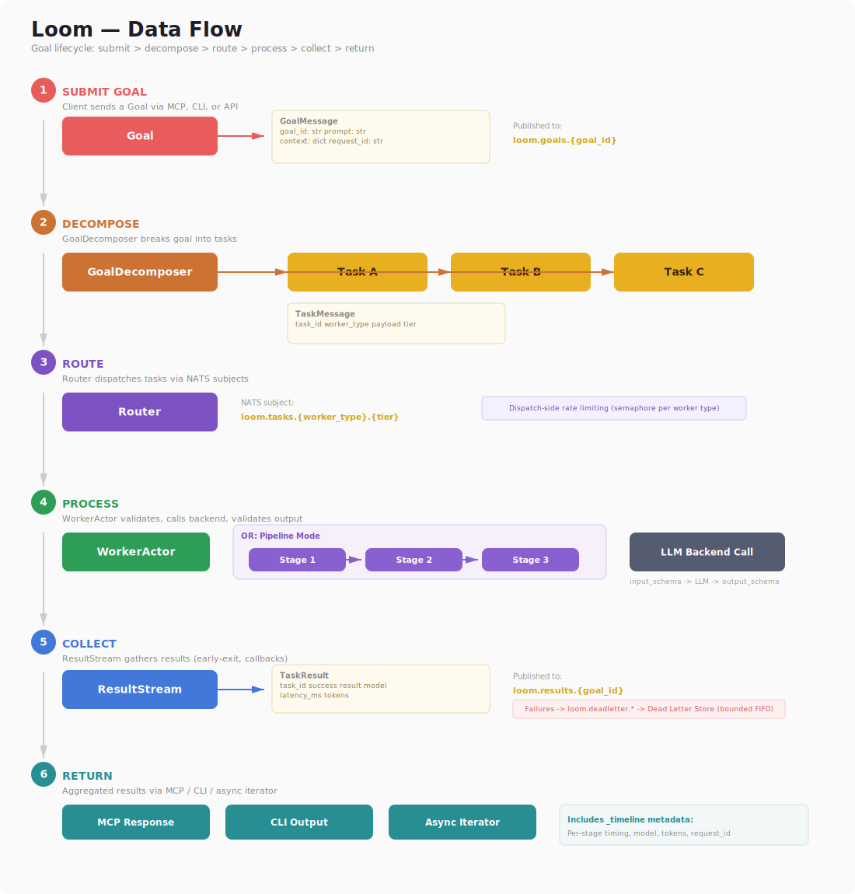

# Architecture

**Loom — Lightweight Orchestrated Operational Mesh**

---

## Overview

Loom is an actor-based framework where narrowly-scoped stateless workers are
coordinated by an orchestrator through a NATS message bus. The router handles
deterministic task dispatch with rate limiting. Workers call LLM backends or
run processing backends, validate I/O against JSON Schema contracts, and
publish results back to the orchestrator.


### NATS Subject Topology


### Data Flow — Goal Lifecycle



---

## Source Tree

```text
src/loom/
├── core/
│   ├── messages.py      # Pydantic schemas: TaskMessage, TaskResult, OrchestratorGoal, CheckpointState
│   ├── actor.py         # Base actor class (NATS subscribe/publish lifecycle)
│   ├── contracts.py     # Lightweight JSON Schema validation for worker I/O
│   ├── workspace.py     # File-ref resolution with path traversal protection
│   └── config.py        # YAML config loader with validation (worker, pipeline, orchestrator, router)
│
├── worker/
│   ├── runner.py        # LLM worker: validate → resolve files → inject knowledge → call LLM → tool loop → validate → publish
│   ├── processor.py     # Non-LLM worker: ProcessingBackend, SyncProcessingBackend, BackendError
│   ├── backends.py      # LLM adapters: Anthropic, Ollama, OpenAI-compatible (with tool-use support)
│   ├── tools.py         # ToolProvider ABC, SyncToolProvider, dynamic tool loader
│   ├── knowledge.py     # Knowledge sources + knowledge silos (folder read/write, tool injection)
│   └── embeddings.py    # EmbeddingProvider ABC, OllamaEmbeddingProvider (/api/embed)
│
├── orchestrator/
│   ├── runner.py        # Orchestrator actor: decompose → dispatch → collect → synthesize (concurrent goals)
│   ├── stream.py        # ResultStream — async iterator for streaming result collection (Strategy A)
│   ├── pipeline.py      # Pipeline orchestrator: dependency-aware parallel stage execution
│   ├── checkpoint.py    # Self-summarization: compresses orchestrator context to Valkey snapshots
│   ├── store.py         # CheckpointStore ABC (pluggable persistence backend)
│   ├── decomposer.py    # LLM-driven goal → subtask decomposition with worker manifest grounding
│   └── synthesizer.py   # Multi-result aggregation (deterministic merge + LLM synthesis modes)
│
├── scheduler/
│   ├── scheduler.py     # Time-driven dispatch actor (cron + interval)
│   └── config.py        # Scheduler config validation
│
├── router/
│   ├── router.py        # Deterministic task routing with dead-letter handling and rate limiting
│   └── dead_letter.py   # DeadLetterConsumer — bounded store, replay with audit trail
│
├── bus/
│   ├── base.py          # MessageBus ABC, Subscription ABC
│   ├── memory.py        # InMemoryBus for testing (no infrastructure needed)
│   └── nats_adapter.py  # NATS pub/sub/request wrapper
│
├── tracing/
│   ├── __init__.py       # Public API: get_tracer, init_tracing, inject/extract_trace_context
│   └── otel.py           # Optional OTel integration (no-op when SDK not installed)
│
├── tui/
│   ├── __init__.py       # Package init
│   └── app.py            # LoomDashboard — Textual TUI, live NATS observer (loom.> wildcard)
│
├── discovery/
│   └── mdns.py           # LoomServiceAdvertiser — mDNS/Bonjour LAN service advertisement
│
├── mcp/
│   ├── config.py           # MCP gateway YAML config loading + validation
│   ├── discovery.py        # Tool definition generators (worker/pipeline/query → MCP tools)
│   ├── bridge.py           # MCPBridge — MCP tool calls → NATS dispatch + result collection
│   ├── resources.py        # WorkspaceResources — workspace files as MCP resources
│   ├── server.py           # create_server(), MCPGateway, run_stdio(), run_streamable_http()
│   ├── council_discovery.py  # council.* MCP tool definitions
│   └── council_bridge.py    # CouncilBridge — in-process council session dispatch
│
├── workshop/
│   ├── test_runner.py   # WorkerTestRunner — execute worker configs against LLM backends directly
│   ├── db.py            # WorkshopDB — DuckDB storage for eval results, versions, metrics, baselines
│   ├── eval_runner.py   # EvalRunner — test suite execution with field_match/exact_match/llm_judge scoring
│   ├── config_impact.py  # Config impact analysis (worker→pipeline reverse mapping)
│   ├── config_manager.py # ConfigManager — CRUD for worker/pipeline YAML configs
│   ├── pipeline_editor.py # PipelineEditor — insert/swap/branch/remove stages
│   ├── app.py           # FastAPI + HTMX + Jinja2 web application
│   ├── templates/       # Jinja2 templates (workers, pipelines, partials)
│   └── static/          # CSS styles
│
├── cli/
│   ├── main.py          # Click CLI: worker, processor, pipeline, orchestrator, scheduler, router, submit, mcp, workshop, ui, mdns, dead-letter
│   └── preflight.py     # Pre-flight checks: NATS connectivity, env vars, config readability
│
└── contrib/
    ├── council/         # Multi-round deliberation framework (optional: uv sync --extra council)
    │   ├── schemas.py       # AgentConfig, CouncilResult, TranscriptEntry, ConvergenceResult
    │   ├── config.py        # CouncilConfig Pydantic model, YAML loading + validation
    │   ├── transcript.py    # TranscriptStore — visibility filtering, token-budget truncation
    │   ├── protocol.py      # DiscussionProtocol ABC + RoundRobin, StructuredDebate, Delphi
    │   ├── convergence.py   # ConvergenceDetector — none, position_stability, llm_judge
    │   ├── runner.py        # CouncilRunner — NATS-free direct execution
    │   └── orchestrator.py  # CouncilOrchestrator — NATS-connected actor mesh execution
    ├── chatbridge/      # External chat/LLM session adapters (optional: uv sync --extra chatbridge)
    │   ├── base.py          # ChatBridge ABC, ChatResponse, SessionInfo
    │   ├── anthropic.py     # AnthropicChatBridge — Claude with session history
    │   ├── openai.py        # OpenAIChatBridge — GPT-4 with session history
    │   ├── ollama.py        # OllamaChatBridge — local models with session history
    │   ├── manual.py        # ManualChatBridge — human-in-the-loop (callback or queue)
    │   └── worker.py        # ChatBridgeBackend — wraps any bridge as ProcessingBackend
    ├── duckdb/          # DuckDB tools and backends (optional: uv sync --extra duckdb)
    ├── redis/           # Valkey-backed CheckpointStore (optional: uv sync --extra redis)
    └── rag/             # RAG pipeline: ingestion, chunking, embedding, analysis

configs/
├── workers/
│   ├── _template.yaml          # Copy this to create new workers
│   ├── summarizer.yaml         # Text → structured summary (local tier)
│   ├── classifier.yaml         # Text → category with confidence (local tier)
│   ├── extractor.yaml          # Text → structured fields (standard tier)
│   ├── rag_ingestor.yaml       # RAG: Telegram stream ingestion
│   ├── rag_chunker.yaml        # RAG: Text chunking
│   ├── rag_vectorstore.yaml    # RAG: Embedding + vector storage
│   ├── rag_mux.yaml            # RAG: Stream multiplexer
│   └── rag_trend_analyzer.yaml # RAG: LLM trend analysis
├── orchestrators/
│   ├── default.yaml            # General-purpose orchestrator config
│   └── rag_pipeline.yaml       # RAG pipeline orchestrator config
├── schedulers/
│   └── example.yaml            # Reference scheduler config (cron + interval examples)
├── councils/
│   └── example.yaml            # Example: 3-agent architecture review council
├── mcp/
│   └── docman.yaml             # Example: document management MCP server config
└── router_rules.yaml           # Tier overrides and rate limits

docker/                   # Dockerfiles and entrypoint script
docs/                     # Documentation (ARCHITECTURE.md, CODING_GUIDE.md, conf.py, index.md, Makefile, ...)
k8s/                      # Kubernetes manifests (Minikube-ready)
tests/                    # Unit + integration tests
```

---

## How the Pieces Connect

1. **You submit a goal** via CLI or publish to `loom.goals.incoming`
   (optionally, **the scheduler** fires goals or tasks on cron/interval timers)
2. **The orchestrator** decomposes it into subtasks (via LLM-driven GoalDecomposer), each targeting a `worker_type`
3. **The router** picks up tasks from `loom.tasks.incoming`, resolves the model tier, enforces rate limits, and publishes to `loom.tasks.{worker_type}.{tier}` (unroutable tasks go to `loom.tasks.dead_letter`)
4. **Workers** (competing consumers via NATS queue groups) pick up tasks, call the appropriate LLM backend, validate the output, and publish results to `loom.results.{goal_id}`
5. **The orchestrator** collects results, decides if more subtasks are needed, and eventually produces a final answer

Workers are stateless — they reset after every task. The orchestrator is longer-lived
but checkpoints itself to Valkey when its context grows too large, compressing history
into a structured summary.

---

## NATS Subject Conventions

| Subject | Purpose |
|---------|---------|
| `loom.goals.incoming` | Top-level goals for orchestrators |
| `loom.tasks.incoming` | Router picks up tasks here |
| `loom.tasks.{worker_type}.{tier}` | Routed tasks; workers subscribe with queue groups |
| `loom.tasks.dead_letter` | Unroutable or rate-limited tasks |
| `loom.results.{goal_id}` | Results flow back to orchestrators |
| `loom.scheduler.{name}` | Scheduler health-check subject |

---

## Design Rules

**Workers are stateless.** They process one task and reset (via `reset()` hook).
No state carries between tasks — this is enforced, not optional.

**All inter-actor communication uses typed Pydantic messages.** `TaskMessage`,
`TaskResult`, `OrchestratorGoal`, `CheckpointState` in `core/messages.py`.

**The router is deterministic.** It does not use an LLM. It routes by
`worker_type` and `model_tier` using rules in `configs/router_rules.yaml`.
Unroutable tasks go to `loom.tasks.dead_letter`.

**Workers have strict I/O contracts.** Validated by `core/contracts.py`. Input
and output schemas are defined per-worker in their YAML config. Boolean values
are correctly distinguished from integers.

**Three model tiers exist:** `local` (Ollama), `standard` (Claude Sonnet etc.),
`frontier` (Claude Opus etc.). The router and task metadata decide which tier
handles each task.

**Rate limiting:** Token-bucket rate limiter enforces per-tier dispatch throttling
based on `rate_limits` in `router_rules.yaml`.

---

## Component Details

### LLM Worker (`worker/runner.py`)

The core worker lifecycle:

1. Receive `TaskMessage` from NATS queue
2. Validate input against worker's `input_schema`
3. Resolve file references from workspace (if configured)
4. Inject knowledge sources into system prompt
5. Call LLM backend with system prompt + user message
6. If tools are configured, run multi-turn tool execution loop (max 10 rounds)
7. Parse and validate output against worker's `output_schema`
8. Publish `TaskResult` to results subject
9. Reset worker state

Features: resilient JSON parsing (strips markdown fences, handles preamble),
knowledge silo loading and write-back, file-ref resolution via WorkspaceManager.

### Processor Worker (`worker/processor.py`)

Non-LLM backend support for CPU-bound or deterministic tasks. Implements
`ProcessingBackend` ABC (async) and `SyncProcessingBackend` (sync, run in
thread pool). Provides `BackendError` hierarchy for structured error handling.

### Orchestrator (`orchestrator/runner.py`)

Full decompose → dispatch → collect → synthesize loop:

- **GoalDecomposer:** LLM-based task decomposition grounded in a worker manifest
- **ResultStream:** Streaming result collection via async iteration — yields results
  as they arrive rather than blocking for all subtasks (Strategy A)
- **ResultSynthesizer:** Deterministic merge + optional LLM synthesis modes
- **CheckpointManager:** Pluggable store (in-memory for testing, Valkey for production), configurable TTL
- **Concurrent goals:** Set `max_concurrent_goals: N` in config to process multiple
  goals simultaneously. All mutable state is per-goal inside `GoalState` —
  concurrent goals are fully isolated with no shared mutable data and no locks.
- **OTel span coverage:** Each orchestrator phase (decompose, dispatch, collect,
  synthesize) is instrumented with OpenTelemetry spans for distributed tracing.

### Pipeline Orchestrator (`orchestrator/pipeline.py`)

Dependency-aware stage execution with automatic parallelism. Stage dependencies
are inferred from `input_mapping` paths — if stage B references `"A.output.field"`,
then B depends on A. Stages with no inter-stage dependencies run concurrently.

Execution proceeds in levels (Kahn's topological sort):

- Level 0: stages with only `goal.*` dependencies (run first, concurrently)
- Level 1+: stages whose dependencies are all in earlier levels

Within each parallel level, stages are executed using
`asyncio.wait(FIRST_COMPLETED)` rather than `asyncio.gather`, enabling
incremental progress reporting as each stage completes.

Explicit `depends_on` lists in stage config override automatic inference.
Supports conditions, per-stage timeouts, input mapping expressions, per-stage
retry (`max_retries`), and inter-stage contract validation
(`input_schema`/`output_schema` on stages).

Typed error hierarchy: `PipelineStageError` → `PipelineTimeoutError`,
`PipelineValidationError`, `PipelineWorkerError`, `PipelineMappingError`.

Each pipeline output includes a `_timeline` with per-stage `started_at`,
`ended_at`, and `wall_time_ms` for observability.

Like `OrchestratorActor`, set `max_concurrent_goals: N` in pipeline config to
process multiple goals concurrently within a single instance.

### Scheduler (`scheduler/scheduler.py`)

Time-driven actor that dispatches goals and tasks on schedules defined
in YAML config. Supports cron expressions (via `croniter`) and fixed-interval
timers. Each schedule entry publishes either an `OrchestratorGoal` to
`loom.goals.incoming` or a `TaskMessage` to `loom.tasks.incoming`.

Config-only design: all schedules are defined at startup. No runtime
control messages. The scheduler extends `BaseActor` with a background
timer loop running alongside the standard message subscription.

Optional dependency: `uv sync --extra scheduler` (for cron support).

### Router (`router/router.py`)

Deterministic task dispatch with:

- Worker type → tier resolution from `router_rules.yaml`
- Token-bucket rate limiting per tier
- Dead-letter routing for unroutable/rate-limited tasks

### Message Bus (`bus/`)

Abstracted behind `MessageBus` ABC:

- `InMemoryBus` for unit testing (no infrastructure)
- `NATSBus` for production
- `BaseActor` accepts `bus=` kwarg for injection

### MCP Gateway (`mcp/`)

Config-driven Model Context Protocol server that exposes LOOM actors as MCP tools.
Any LOOM system becomes an MCP server with a single YAML config — zero MCP-specific
code needed.

- **Config** (`config.py`): Load and validate MCP gateway YAML
- **Discovery** (`discovery.py`): Auto-generate MCP tool definitions from worker,
  pipeline, and query backend configs
- **Bridge** (`bridge.py`): Dispatch MCP tool calls as NATS messages and collect results
- **Resources** (`resources.py`): Expose workspace files as MCP resources with
  `workspace:///` URIs and change notifications
- **Server** (`server.py`): Assemble the MCP server with stdio and streamable-http transports

Tool discovery flow: Worker YAML `name` + `input_schema` + `description` → MCP tool.
Pipeline `input_mapping` `goal.context.*` fields → tool input schema. Query backend
`_get_handlers()` → per-action tools with auto-generated schemas.

### Worker Workshop (`workshop/`)

Web-based worker builder and eval tool. Operates without NATS — testing and
evaluation call LLM backends directly via `execute_with_tools()`.

- **WorkerTestRunner** (`test_runner.py`): Execute a worker config against a
  payload without the actor mesh. Builds the full prompt, calls the LLM, validates
  I/O contracts.
- **EvalRunner** (`eval_runner.py`): Run test suites with `field_match`,
  `exact_match`, or `llm_judge` scoring (LLM evaluates output quality on
  correctness/completeness/format). Concurrent test case execution with
  semaphore-bounded parallelism. Golden dataset baselines for regression detection.
- **ConfigManager** (`config_manager.py`): CRUD for worker/pipeline YAML configs
  with hash-based version tracking in DuckDB.
- **PipelineEditor** (`pipeline_editor.py`): Insert, remove, swap, or branch
  pipeline stages with dependency validation. Reuses
  `PipelineOrchestrator._infer_dependencies()`.
- **WorkshopDB** (`db.py`): DuckDB storage for eval runs, results, worker versions,
  metrics, and eval baselines (golden dataset regression detection).
- **Web UI** (`app.py`): FastAPI + HTMX + Jinja2 + Pico CSS. Worker list/editor,
  test bench, eval dashboard, pipeline editor with dependency graph.

Optional dependency: `uv sync --extra workshop`.

### Distributed Tracing (`tracing/`)

Optional OpenTelemetry integration for end-to-end distributed tracing across
the actor mesh. Install with `uv sync --extra otel`.

- **Graceful no-op:** When OTel SDK is not installed, all tracing functions
  become no-ops. No code changes needed for bare-metal deployments.
- **W3C traceparent propagation:** Trace context is injected into NATS messages
  via a `_trace_context` key and extracted on the receiving end. This links
  spans across actor boundaries for full pipeline visibility.
- **Span coverage:** `BaseActor._process_one()`, `TaskRouter.route()`,
  `PipelineOrchestrator._execute_stage()`, `MCPBridge._dispatch_and_wait()`,
  orchestrator phases (decompose, dispatch, collect, synthesize), LLM calls
  and tool continuation rounds in `execute_with_tools()`.

LLM call spans follow the **OTel GenAI semantic conventions**
(<https://opentelemetry.io/docs/specs/semconv/gen-ai/>):

- `gen_ai.system` — provider identifier (`anthropic`, `ollama`, `openai`)
- `gen_ai.request.model` / `gen_ai.response.model` — model names
- `gen_ai.usage.input_tokens` / `gen_ai.usage.output_tokens` — token counts
- `gen_ai.request.temperature` / `gen_ai.request.max_tokens` — request params

Set `LOOM_TRACE_CONTENT=1` to additionally record prompt and completion text as
span events (`gen_ai.content.prompt`, `gen_ai.content.completion`). This may
contain PII — use only in development or secure environments.

Legacy `llm.*` attributes are preserved for backward compatibility.

Use any OTel-compatible backend (Jaeger, Zipkin, Grafana Tempo) to visualize
traces. Initialize with `init_tracing(service_name="loom")` at startup.

### TUI Dashboard (`tui/`)

Real-time terminal dashboard for observing the actor mesh. Connects to NATS
and renders live updates in a Textual-based terminal UI.

```bash
loom ui --nats-url nats://localhost:4222
```

Four panels:

- **Goals** — active goals with status, subtask count, elapsed time
- **Tasks** — dispatched tasks with worker type, tier, model, elapsed
- **Pipeline** — pipeline stage execution with wall time
- **Events** — scrolling log of all `loom.>` NATS messages

The dashboard is read-only — it subscribes to `loom.>` wildcard but never
publishes. Safe to run alongside production actors. Keybindings: `q` quit,
`c` clear log, `r` refresh tables.

Optional dependency: `uv sync --extra tui`.

### Contrib Packages

- **DuckDB** (`contrib/duckdb/`): `DuckDBViewTool` (view-based LLM tool),
  `DuckDBVectorTool` (semantic similarity search), `DuckDBQueryBackend`
  (FTS, filtering, stats, vector search)
- **Valkey** (`contrib/redis/`): `RedisCheckpointStore` for production checkpoint persistence
- **RAG** (`contrib/rag/`): Telegram ingestion, text normalization, chunking,
  vector storage, LLM analysis actors

---

## Worker Configuration

Workers are configured via YAML files in `configs/workers/`. Each config defines:

```yaml
name: summarizer
worker_kind: llm             # or "processor"
default_model_tier: local    # local | standard | frontier
system_prompt: |
  You are a text summarizer...
input_schema:
  type: object
  properties:
    text: { type: string }
  required: [text]
output_schema:
  type: object
  properties:
    summary: { type: string }
  required: [summary]
```

Copy `configs/workers/_template.yaml` to create new workers. See
[Building Workflows](building-workflows.md) for a comprehensive guide.

---

## Scaling

### Horizontal scaling (preferred)

NATS queue groups provide horizontal scaling with zero code changes. Run multiple
instances of any actor and they automatically load-balance — each message is
delivered to exactly one instance within the queue group.

Workers, orchestrators, and pipeline orchestrators all subscribe with queue groups
by default. In Kubernetes, scale via replica count or HPA.

### Vertical scaling (within a single instance)

- **OrchestratorActor:** Set `max_concurrent_goals` in orchestrator config to
  process multiple goals concurrently within one process.
- **PipelineOrchestrator:** Independent stages run concurrently within a single
  goal (automatic from dependency inference). Set `max_concurrent_goals` in
  pipeline config to process multiple goals concurrently within one instance.
- **Workers:** Workers are single-task actors (`max_concurrent=1`). Scale
  horizontally via replicas, not vertically.

### Implemented optimizations

- **Streaming result collection (Strategy A):** `ResultStream` in
  `orchestrator/stream.py` yields results as they arrive via async iteration.
  Supports `on_result` callbacks for progress notifications and early exit.
- **Pipeline incremental progress (Strategy C enhancement):** Parallel levels
  use `asyncio.wait(FIRST_COMPLETED)` for incremental stage completion
  reporting instead of blocking on the entire level.

### Future optimizations

- **Worker-side batching (Strategy D):** Batch similar tasks into single LLM
  calls, reducing API overhead.
- **Decomposition caching (Strategy E):** Cache goal decomposition plans for
  repeated patterns, skipping the decomposition LLM call.

---

## Config Validation

All config types are validated at startup (fail-fast). If a config file contains
invalid values, the system raises `ConfigValidationError` before any actor starts.

- **Worker:** `name` required, must have `system_prompt` (LLM) or `processing_backend`
  (processor), valid `default_model_tier` (local/standard/frontier), well-formed
  `input_schema`/`output_schema` structure, numeric bounds on `timeout` and
  `max_tokens`.
- **Pipeline:** stage names must be unique, valid tier per stage, `input_mapping`
  structure validated, `depends_on` references must point to existing stages,
  condition expressions validated for syntax.
- **Orchestrator:** checkpoint settings (TTL, threshold), `max_concurrent_goals`
  limits, `available_workers` list.
- **Router:** `tier_override` values must be valid tiers, `rate_limit` structure
  validated (rate, burst).
- **Scheduler:** cron expressions and dispatch types validated by
  `loom.scheduler.config`.
- **MCP:** tool sources, backend import paths, and resource config validated by
  `loom.mcp.config`.

All shipped configs in `configs/` are validated in CI via `test_config_shipped.py`.

---

*For setup instructions, see [Getting Started](GETTING_STARTED.md).
For Kubernetes deployment, see [Kubernetes](KUBERNETES.md).*
