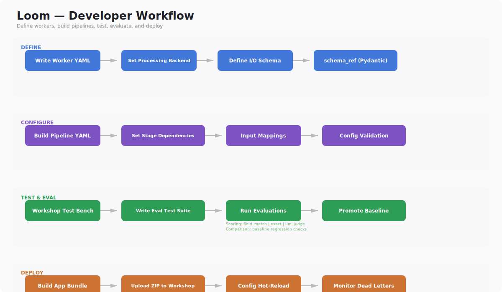

# Getting Started

New to Heddle? Start with [Concepts](CONCEPTS.md) to understand the mental model.



---

## Quick Start — Try a Worker (No Data Files Needed)

The fastest way to see Heddle work. Paste any text and get structured output.

```bash
# 1. Install
pip install heddle-ai[workshop]

# 2. Configure (interactive wizard — detects Ollama, prompts for API keys)
heddle setup

# 3. Open the Workshop web UI
heddle workshop
```

Open your browser at `http://localhost:8080`. You'll see a list of workers.
Click any worker → **Test** → paste text into the input box → click **Run**.

Try these first:

- **summarizer** — paste an article, get a structured summary with key points
- **classifier** — paste text and a list of categories, get a classification with confidence score
- **extractor** — paste a contract or report, define fields to extract (names, dates, amounts)
- **qa** — paste a passage and ask a question, get an answer with source citations

All four work with Ollama (free, local). If you don't have Ollama, `heddle setup`
will prompt for an Anthropic API key instead.

See [Workers Reference](workers-reference.md) for full I/O schemas and the
[Workshop Tour](WORKSHOP_TOUR.md) for what each screen does.

---

## RAG Quickstart

If you have Telegram JSON exports, Heddle can ingest, chunk, embed, and search
them:

```bash
# 1. Install with RAG support
pip install heddle-ai[rag]

# 2. Configure
heddle setup

# 3. Ingest Telegram exports
heddle rag ingest /path/to/telegram/exports/*.json

# 4. Search
heddle rag search "earthquake damage reports"

# 5. Open the dashboard
heddle rag serve
```

The `heddle setup` wizard detects Ollama, prompts for API keys, and writes
`~/.heddle/config.yaml`. All settings can be overridden via environment
variables or CLI flags. See [Configuration](CONFIG.md) for details.

---

## Build Your First Worker

Once you've tested the shipped workers, build your own — or chain existing
ones into a pipeline:

| Worker | What it does | Tier |
|--------|-------------|------|
| `summarizer` | Compress text into structured summary with key points | local |
| `classifier` | Assign text to categories with confidence | local |
| `extractor` | Pull structured fields from unstructured text | standard |
| `translator` | Translate between languages with auto-detection | local |
| `qa` | Answer questions from provided context with citations | local |
| `reviewer` | Review content quality against configurable criteria | standard |

```bash
# Create your own worker interactively (generates YAML for you)
heddle new worker

# Chain workers into a pipeline
heddle new pipeline

# Validate configs (no infrastructure needed)
heddle validate configs/workers/*.yaml

# Test in the Workshop
heddle workshop
```

No NATS or infrastructure needed. The Workshop calls LLM backends directly.

> **That's it for basic usage.** Everything below is for when you need the
> full distributed infrastructure (multi-user, scaling, continuous processing).

---

## Prerequisites (Full Infrastructure)

- Python 3.11+
- [uv](https://docs.astral.sh/uv/) package manager (recommended for development)
- At least one LLM backend (Ollama recommended to start)
- NATS and Valkey for full infrastructure (not needed for Quick Start)

---

## 1. Install Python Dependencies

```bash
# Requires uv (https://docs.astral.sh/uv/)
uv sync --all-extras
```

Heddle has optional extras for integrations:

```bash
uv sync --extra rag           # RAG pipeline (DuckDB + Ollama embeddings)
uv sync --extra lancedb       # LanceDB vector store (ANN search, alternative to DuckDB)
uv sync --extra telegram      # Live Telegram channel capture via Telethon
uv sync --extra duckdb        # DuckDB tools and query backends
uv sync --extra redis         # Redis/Valkey-backed checkpoint store
uv sync --extra local         # Ollama client for local models
uv sync --extra workshop      # Worker Workshop web UI (FastAPI, Jinja2, DuckDB)
uv sync --extra mcp           # MCP gateway (Model Context Protocol)
uv sync --extra otel          # OpenTelemetry distributed tracing
uv sync --extra tui           # Terminal dashboard (Textual)
uv sync --extra mdns          # mDNS/Bonjour service discovery on LAN
uv sync --extra scheduler     # Cron expression parsing (croniter)
uv sync --extra eval          # DeepEval LLM output quality evaluation
uv sync --extra docs          # MkDocs-Material API documentation generation
```

---

## 2. Configure LLM Backends

The easiest path — run the setup wizard:

```bash
uv run heddle setup
```

This auto-detects Ollama, prompts for API keys, and writes `~/.heddle/config.yaml`.

**Or configure manually** via environment variables:

```bash
# Option A: Ollama (free, local, recommended to start)
brew install ollama
ollama serve &
ollama pull llama3.2:3b
export OLLAMA_URL=http://localhost:11434

# Option B: Anthropic API
export ANTHROPIC_API_KEY=sk-ant-...

# Option C: Any OpenAI-compatible API (vLLM, LiteLLM, llama.cpp server)
# See OpenAICompatibleBackend in src/heddle/worker/backends.py
```

Settings resolution priority: CLI flags > environment variables > `~/.heddle/config.yaml` > built-in defaults. See [Configuration](CONFIG.md) for the full reference.

---

## 3. Run the Unit Tests (No Infrastructure Needed)

```bash
uv run pytest tests/ -v -m "not integration and not deepeval"
```

This runs all unit tests without needing NATS or Valkey.

---

## 4. Set Up Infrastructure (NATS + Valkey)

> **Skip this** if you only need the RAG pipeline or Workshop.
> The steps below are for the full distributed actor mesh.

```bash
# Install via Homebrew (Mac) or use Docker
brew install nats-server valkey

# Start them
nats-server &
valkey-server &
```

Or with Docker:

```bash
docker run -d --name nats -p 4222:4222 nats:2.10-alpine
docker run -d --name valkey -p 6379:6379 valkey/valkey:8-alpine
```

---

## 5. Start the Router, Orchestrator, and a Worker

```bash
# Terminal 1: Start the router
uv run heddle router --nats-url nats://localhost:4222

# Terminal 2: Start the orchestrator
uv run heddle orchestrator --config configs/orchestrators/default.yaml --nats-url nats://localhost:4222

# Terminal 3: Start a summarizer worker
uv run heddle worker --config configs/workers/summarizer.yaml --tier local --nats-url nats://localhost:4222
```

---

## 6. Submit a Test Task

```bash
# Terminal 4: Send a task through the system
uv run heddle submit "Summarize the main points of the UN Charter preamble" --nats-url nats://localhost:4222
```

Monitor what's happening:

```bash
# Option 1: TUI dashboard (recommended)
uv sync --extra tui
uv run heddle ui --nats-url nats://localhost:4222

# Option 2: NATS CLI (raw messages)
brew tap nats-io/nats-tools && brew install nats-io/nats-tools/nats
nats sub "heddle.>" --server=nats://localhost:4222
```

---

## 7. Create Your Own Worker

```bash
cp configs/workers/_template.yaml configs/workers/my_worker.yaml
```

Edit the file — define a system prompt, input/output schemas, and default tier.
Then start it:

```bash
uv run heddle worker --config configs/workers/my_worker.yaml --tier local
```

Or test it without NATS using the Workshop:

```bash
uv run heddle workshop --port 8080
# Open http://localhost:8080 → Workers → my_worker → Test
```

---

## What's Next

| Goal | Guide |
|------|-------|
| Understand the mental model | [Concepts](CONCEPTS.md) |
| How Heddle compares to other tools | [Why Heddle?](WHY_HEDDLE.md) |
| Tour the Workshop UI | [Workshop Tour](WORKSHOP_TOUR.md) |
| Build workers, pipelines, tools | [Building Workflows](building-workflows.md) |
| Set up RAG analysis pipeline | [RAG How-To](rag-howto.md) |
| Configure settings and API keys | [Configuration](CONFIG.md) |
| Full CLI command reference | [CLI Reference](CLI_REFERENCE.md) |
| Test and evaluate workers | [Workshop](workshop.md) |
| Deploy to production | [Local Deployment](LOCAL_DEPLOYMENT.md) / [Kubernetes](KUBERNETES.md) |
| Debug issues | [Troubleshooting](TROUBLESHOOTING.md) |
| Understand design decisions | [Design Invariants](DESIGN_INVARIANTS.md) |

---

*For architecture details, see [Architecture](ARCHITECTURE.md).
For the full CLI reference, see [CLI Reference](CLI_REFERENCE.md).*
